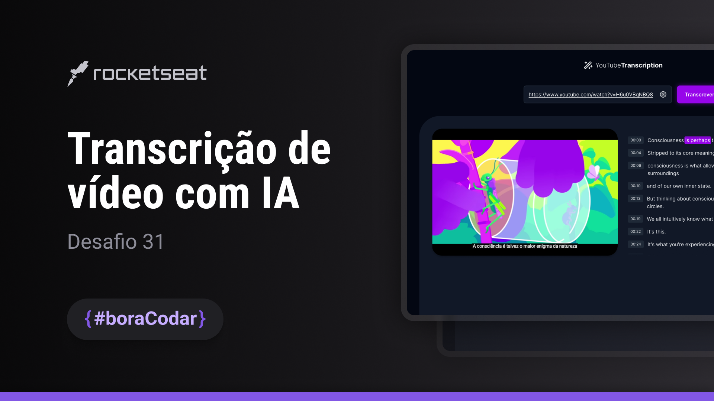

<h1><strong>AI Transcription</strong></h1>

Thirty-first Challenge was to create a Artificial Intelligence Transcription page, which converts the audio of a YouTube video into text. For this project's AI, the idea was to use <a href='https://github.com/xenova/transformers.js'>transformers.js</a> which makes it possible to use AI in our browser, without the need for an <a href='https://platform.openai.com/account/api-keys'>OpenAI token</a>.
 
 
However, the loading and conversion speed is very high, and as this is an educational project, I used a json file with data from an example <a href='https://www.youtube.com/watch?v=eHz8ns_n_Fg'>video</a>.
 
 
I made it using Next.Js with TypeScript and Tailwind, and a Node.Js server!

 

 
